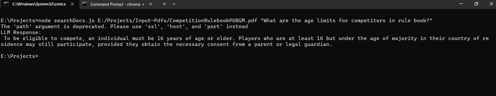

# DocumentsRAG
This application is useful to search through long documentations in natural language, you may want to search lengthy documents sometimes they are too large to upload to frontier LLM's. And sometimes they are private that can not be shared across networks. In this case it can be configured to local network open source generative model.

## Instructions
1. Pull the code
2. Run
3. ```cmd
   npm install
4. place you document in Input-Pdfs/ in project directory
5. Run
6. ```cmd
   node searchDocs.js [inputpath] [query]

#### Look at this test case for overview
eg: PUBG competition rule book.

